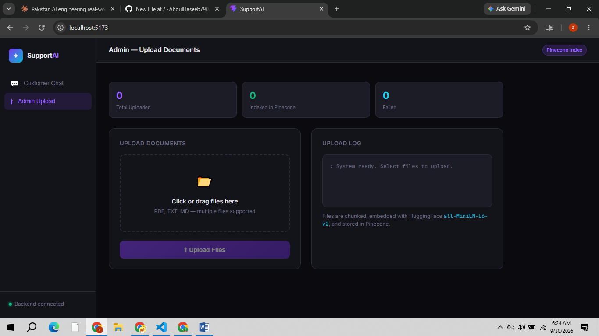

<div align="center">

# 🤖 Customer Support Agent

**A RAG-powered AI support agent with guardrails and human escalation, built with FastAPI, LangGraph, Groq, and Pinecone.**


[Demo](#-demo) · [Features](#-features) · [Architecture](#-architecture) · [Getting Started](#-getting-started) · [API](#-api-reference)

</div>

---

## 📖 Overview

Customer Support Agent lets a business turn its own documents into an AI support assistant. An admin uploads documents, which are chunked, embedded, and stored in **Pinecone**. Customers then chat with an agent that retrieves the most relevant content and generates grounded answers using a **Groq**-hosted LLM, streamed back to the UI in real time.

The agent is a **LangGraph** workflow made of four nodes: a **guardrail** that checks whether a message is relevant to the business, a **retriever** that searches the knowledge base, an **escalation** check that decides whether a human should take over, and a **generator** that writes the final answer.

## 🎬 Demo

<p align="center">
  
  
</p>

## ✨ Features

- 📤 **Admin document upload**: businesses add their own knowledge base
- ✂️ **Automatic chunking and embedding** stored in Pinecone
- 🔎 **Retrieval-Augmented Generation (RAG)** for answers grounded in real content
- 🛡️ **Guardrail node** that checks each message for relevance and filters off-topic questions
- 🙋 **Escalation node** that decides whether to escalate to a human or proceed
- ⚡ **Streaming responses** for a fast, chat-like experience
- 🆓 **Free-tier friendly** with Groq for LLM inference

## 🏗️ Architecture

### Admin flow

```
Business uploads docs ──► FastAPI (/upload) ──► Chunk + Embed ──► Pinecone
```

### Customer flow

```
Customer ──► React UI ──► FastAPI (/chat) ──► LangGraph Agent ──► Streamed response ──► UI
```

### LangGraph agent

```
message ──► Guardrail ──── irrelevant ────► END
                │
                │ relevant
                ▼
            Retriever  (Pinecone)
                │
                ▼
            Escalation ──── escalate ────► END (flagged for human)
                │
                │ proceed
                ▼
            Generator  (Groq LLM) ──────► END (final answer)
```

The graph ends early in two cases: the guardrail marks the message as irrelevant, or the escalation check decides a human should handle it.

The agent shares a typed state (`AgentState`) across nodes:

| Field | Set by | Description |
| ----- | ------ | ----------- |
| `user_message` | input | The customer's message |
| `relevance` | Guardrail | Whether the message is relevant to the business |
| `context` | Retriever | Relevant chunks retrieved from Pinecone |
| `escalation` | Escalation | Decision to escalate or proceed |
| `final_answer` | Generator | The response returned to the customer |

| Node | File | Responsibility |
| ---- | ---- | -------------- |
| Guardrail | `agent/guardrail.py` | Checks whether the message is relevant before processing |
| Retriever | `agent/retriever.py` | Fetches relevant chunks from Pinecone |
| Escalation | `agent/escalation.py` | Decides whether the query needs a human |
| Generator | `agent/generator.py` | Produces the answer from the message and retrieved context |
| Graph | `agent/graph.py` | Wires the nodes together with LangGraph |

## 🛠️ Tech Stack

| Layer            | Technology                              |
| ---------------- | --------------------------------------- |
| Frontend         | React + Vite *(in progress)*            |
| API              | FastAPI, Pydantic                       |
| Agent framework  | LangChain, LangGraph                    |
| LLM              | Groq (`langchain-groq`)                 |
| Embeddings       | Hugging Face (`langchain-huggingface`)  |
| Vector database  | Pinecone (`langchain-pinecone`)         |
| Config           | python-dotenv                           |

## 📁 Project Structure

```
customer-support-agent/
├── backend/
│   ├── agent/
│   │   ├── __init__.py
│   │   ├── guardrail.py      # Input screening
│   │   ├── retriever.py      # Pinecone retrieval
│   │   ├── escalation.py     # Human handoff logic
│   │   ├── generator.py      # LLM answer generation
│   │   └── graph.py          # LangGraph workflow
│   ├── routes/
│   │   ├── __init__.py
│   │   ├── upload.py         # POST /upload
│   │   └── chat.py           # POST /chat
│   ├── main.py               # FastAPI entry point
│   └── requirements.txt
└── frontend/                 # React + Vite (chat UI + admin upload page)
```

## 🚀 Getting Started

### Prerequisites

- Python 3.10+
- Node.js 18+ *(for the frontend)*
- A free [Groq API key](https://console.groq.com/)
- A [Pinecone](https://www.pinecone.io/) account and API key

### 1. Clone the repository

```bash
git clone https://github.com/AbdulHaseeb790/Customer-Support-Agent.git
cd Customer-Support-Agent
```

### 2. Backend setup

```bash
cd backend
python -m venv venv
source venv/bin/activate        # Windows: venv\Scripts\activate
pip install -r requirements.txt
```

Create a `.env` file inside `backend/`:

```env
GROQ_API_KEY=your_groq_api_key
PINECONE_API_KEY=your_pinecone_api_key
PINECONE_INDEX_NAME=your_index_name
```

> **[EDIT]** Match the variable names to what your code reads.

Run the server:

```bash
uvicorn main:app --reload
```

The API runs at `http://localhost:8000`, with interactive docs at `http://localhost:8000/docs`.

### 3. Frontend setup

```bash
cd frontend
npm install
npm run dev
```

## 📡 API Reference

### `POST /upload`

Uploads a document, splits it into chunks, embeds them, and stores them in Pinecone.

- **Content-Type:** `multipart/form-data`
- **Body:** `file` (the document to ingest)

### `POST /chat`

Sends a customer message to the LangGraph agent and streams the response.

Request:
```json
{
  "message": "How do I return an item?"
}
```

Response: a streamed text response with the agent's answer.

> **[EDIT]** Update field names and supported file types to match your routes.

## 💡 Usage

1. Open the **admin page** and upload your support documents (FAQs, policies, guides).
2. Open the **chat page** and ask a question, for example *"What is your refund policy?"*
3. The guardrail checks relevance, the retriever finds matching content, and the escalation step decides whether a human is needed.
4. If not, the generator streams back an answer grounded in your documents.

## 🗺️ Roadmap

- [x] FastAPI backend with `/upload` and `/chat`
- [x] LangGraph agent with guardrail, retriever, generator, and escalation
- [ ] React + Vite frontend (chat UI and admin upload page)
- [ ] Conversation memory across turns
- [ ] Authentication for the admin page
- [ ] Docker and deployment setup

## 🤝 Contributing

1. Fork the repository
2. Create a branch: `git checkout -b feature/your-feature`
3. Commit your changes: `git commit -m "Add your feature"`
4. Push: `git push origin feature/your-feature`
5. Open a Pull Request

## 📄 License

Distributed under the MIT License. See `LICENSE` for details.

## 👤 Author

**Abdul Haseeb**
GitHub: [@AbdulHaseeb790](https://github.com/AbdulHaseeb790)

---

<div align="center">⭐ If you find this project useful, consider giving it a star!</div>
